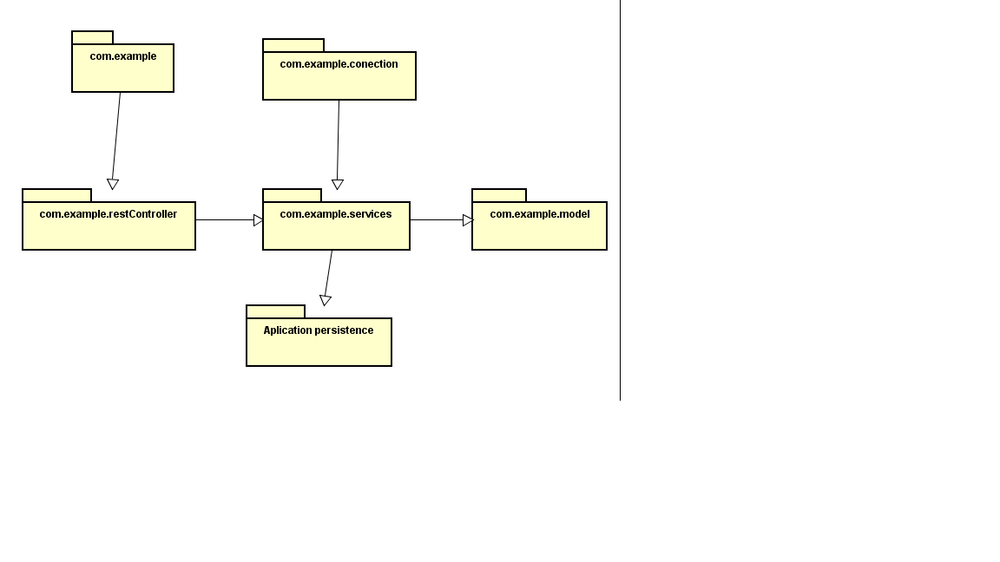

### Escuela Colombiana de Ingeniería

### Arquitecturas de Software

Se realizo una appRest para poder consultar el mercado de valores de las acciones negociadas en la Bolsa.

La aplicacion utiliza un identificador como accion y muestra el historico de la valoracion en diferentes 
periodos de tiempo.

La aplicacion utiliza un API gratuito de ALPHAVANTAGE. Tiene respaldo de una base de datos y de esta
 manera solo consulte cuando no tenga registros en ella de la compañia consultada.
 
 
 
 